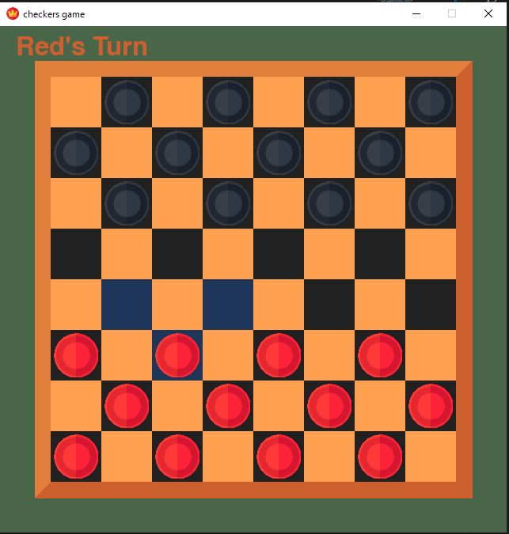

# Checkers game

simple checkers game


## Overeview

This projec is a Python Pygame game.


## Features

for now just desplays the board

## Screenshots



## Project Structure

* checkers/
  * imgs/
  * asset.py
  * board.py
  * checkers.py
  * config.py
  * main.py
  * piece.py

## Installation

Just need Python and install Pygame

```bash
  pip install pygame
```
