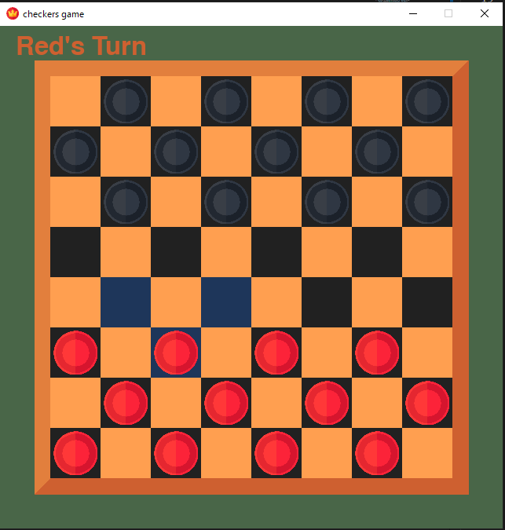
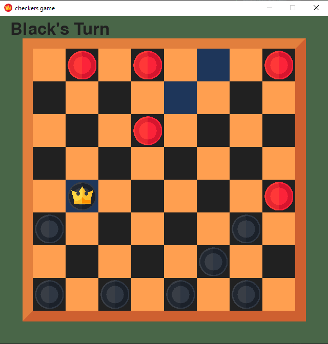
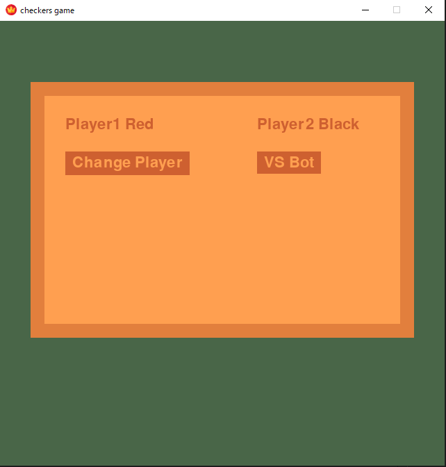

# Checkers game

simple checkers game


## Overeview

This projec is a Python Pygame game, imitating classic checkers.


## Features

* GUI desplays the board
* After starting new game the pieces are set on correct positions
* On click you can see possible moves
* You can move and capture other pieces
* Promoted king pieces have privilaged moves
* On clicking space key you can open menu and change settings like:  
  * player piece color
  * play against other player or bot (in progress)

## Screenshots





## Project Structure


* checkers/
  * src/
    * assets/
      * asset.py
      * imgs/
    * config/
      * config.py
    * UI/
      *game.py
    * logic/
      * board.py
      * piece.py
    * main.py
  * README.md
  
## Installation

Just need Python and install Pygame

```bash
  pip install pygame
```
